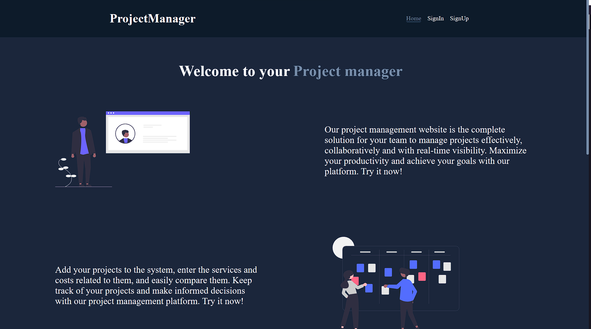
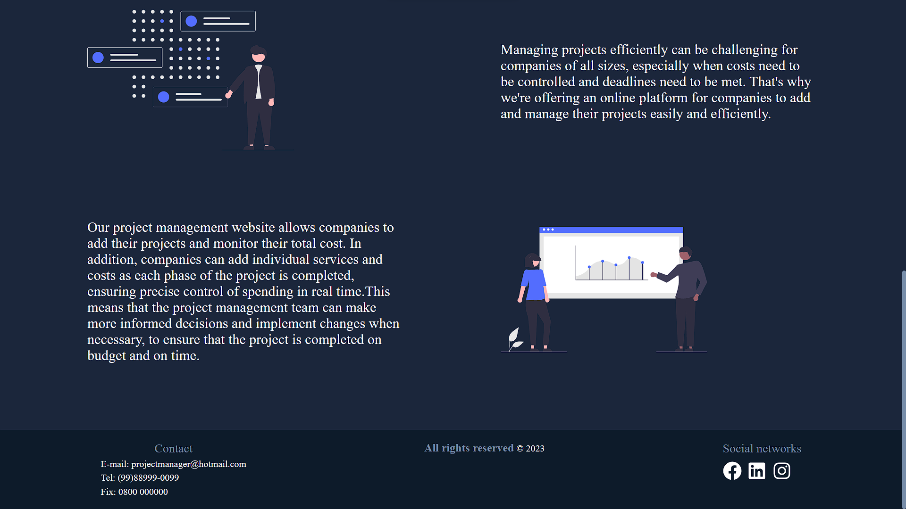
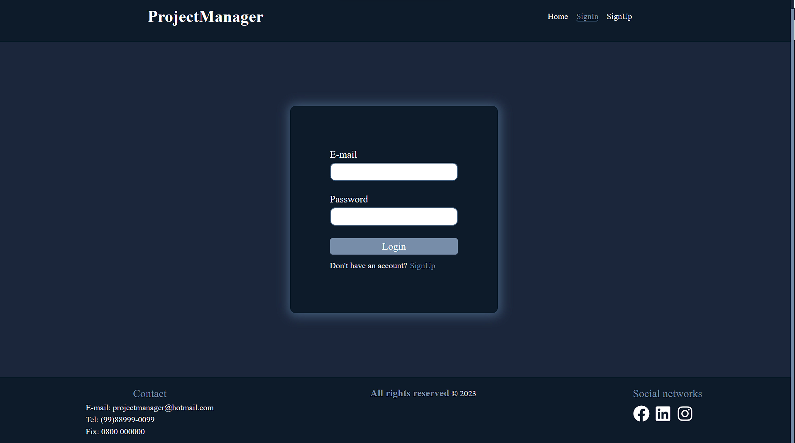
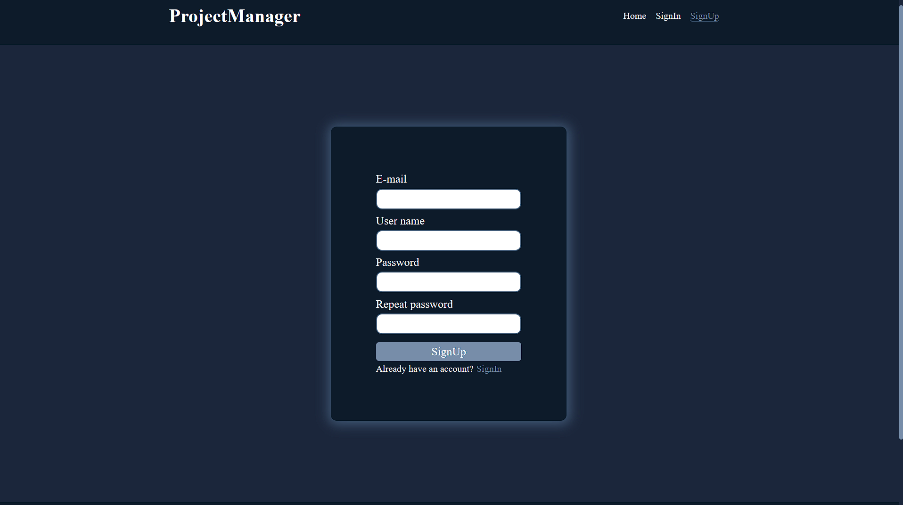
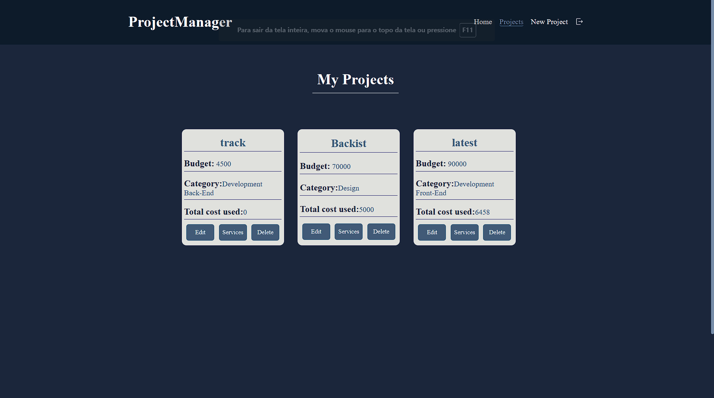
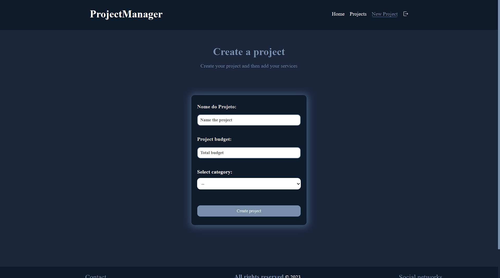
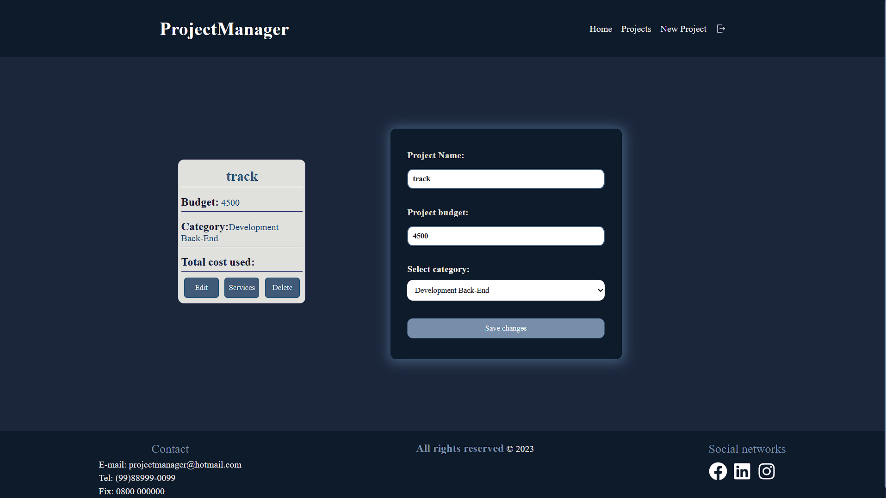

<h1 align="center">ProjectManager</h1>

## ℹ About ProjectManager
<hr/>
Web site developed for project management. Anyone can use them, both companies and people with small personal projects, adding the projects and the total budget, and within each project can add the services and costs of each service, thus keeping in order the spreadsheet of expenses to compare the final values of everything.


## 🎨 Layout
<hr/>
Upon entering the site, users will come across 3 pages.
<ul>
  <li><b>Home</b> - Containing the presentation and details of the site, both its purpose and an incentive to use.</li> 
  <li><b>SignIn</b> - Where the user will log in to their account they just created.</li>
	<li><b>SignUp</b> - Where the user will be creating their account.</li>
</ul>

After logging in, the user will have access to the other pages.
<ul>	
	<li><b>Projects</b> - where the projects that the user adds will be allocated.</li>
	<li><b>NewProjects</b> - Where the user can create add their projects.</li>
	<li><b>Services</b> - Where is the addition of services in the selected projects.</li>
	<li><b>Project Edit</b> - Where is the addition/correction of things that needed to be added to the project card done.</li>
</ul>

<div>








</div>


## 🛠️ Built with
<hr/>
This project was developed with the following technologies:

-   [React](https://react.dev/)
-   [React Router Dom](https://reactrouter.com/en/main)
-   [React Icons](https://react-icons.github.io/react-icons/)
-   [React Hook Form](https://react-hook-form.com/)
-   [React Toastfy](https://fkhadra.github.io/react-toastify/introduction/)
-   [Google Fonts](https://fonts.google.com/)
-   [Styled Components](https://styled-components.com/)
-   [yup](https://www.npmjs.com/package/yup)
-   [bcrypt](https://www.npmjs.com/package/bcrypt)
-	[uuid](https://www.npmjs.com/package/uuid)
-   [ESLint](https://eslint.org/)
-   [Prettier](https://prettier.io/)
-   [VS Code](https://code.visualstudio.com/)

## 🚀 How to run
<hr/>


```bash
# Clone this repository
$ git clone https://github.com/JoaoProfeta/ManagerProjects.git

# Access the project folder
$ cd ProjectManager

# install all dependencies
$ yarn || npm install

# run aplication
$ yarn dev || npm run

```

## 📝 Get in touch
<hr/>

<a href="https://www.linkedin.com/in/jo%C3%A3o-vitor-de-jesus-profeta-195bb0239/" target="_blank" >
  
</a>
<a href="https://github.com/JoaoProfeta" target="_blank" >
  
</a>

